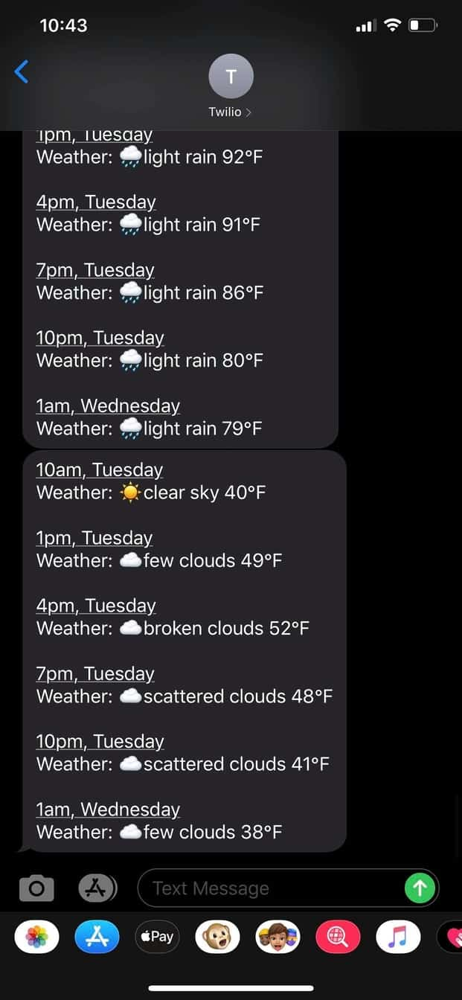

# Weather Me

1. [Official Hackathon Challenge Post](https://dev.to/devteam/announcing-the-twilio-hackathon-on-dev-2lh8)
2. [Intro Post](https://dev.to/shimphillip/get-customized-weather-updates-through-sms-231o)
3. [Wrap up Post](https://dev.to/shimphillip/get-customized-weather-updates-through-sms-231o)




## Getting Started

Visit to see the live app https://weather-me-54a7d.web.app/

### Prerequisites

`Git & NPM & Firebase CLI`

https://firebase.google.com/docs/cli?hl=vi#mac-linux-npm

### Installation steps

```zsh
# clone the repo
git clone https://github.com/shimphillip/weather-me.git

# navigate to the functions directory
cd weather-me/functions

# install packages
npm install or yarn

# start the app
firebase serve

```

## Deployment

```zsh
# deploy the app
firebase deploy

# deploy only cloud functions
firebase deploy --only functions
```

## Versioning

1.0.0

## Authors

- **Phillip Shim**

## Gotchas

Be patient! These firebase lambdas functions unfortunately take a long time to wake up from hibernation if they haven't been used for a long time. I am talking 5-10 seconds and maybe up to 20 seconds 💩. I haven't implemented spinners or alerts to notify the loading state yet. So I would at least wait 10 seconds when making CRUD operations.

## Extra Todos

- [ ] Add testing (Look at emulators)
- [ ] Wrap it in a docker container
- [ ] Make it fully responsive
- [ ] Handle Errors (Make the app not crash if not following the happy path)
- [ ] Make fields in DB unique (email and phone number)
- [ ] Allow users to choose a time when they can receive text messsages
- [ ] Make the app interactive. Send commands to the twilio phone number and receive something back
- [ ] And some more...

## License

This project is licensed under the MIT License - see the [LICENSE.md](LICENSE.md) file for details
