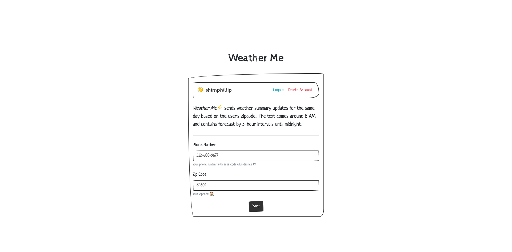

# Weather Me

1. [Official Hackathon Challenge Post](https://dev.to/devteam/announcing-the-twilio-hackathon-on-dev-2lh8)
2. [Intro Post](https://dev.to/shimphillip/get-customized-weather-updates-through-sms-231o)
3. [Wrap up Post](https://dev.to/shimphillip/get-customized-weather-updates-through-sms-231o)


Text Message Image

## Getting Started

Visit to see the live app https://just-todo-it.netlify.com/

### Prerequisites

`Git & NPM & Firebase CLI`

https://firebase.google.com/docs/cli?hl=vi#mac-linux-npm

### Installation steps

```zsh
# clone the repo
git clone https://github.com/shimphillip/weather-me.git

# navigate to the functions directory
cd weather-me/functions

# install packages
npm install or yarn

# start the app
firebase serve

# Deploy functions
firebase deploy --only functions
```

## Deployment

Easy deployment with netlify :)

## Versioning

1.0.0

## Authors

- **Phillip Shim**

## License

This project is licensed under the MIT License - see the [LICENSE.md](LICENSE.md) file for details
